# ⚛️ Governed Quantum Agents (GQA)

**A governed, natural language interface to quantum-powered discovery.**

[](https://python.org)
[](https://quantumai.google/cirq)
[](https://cloud.google.com/vertex-ai)
[](LICENSE)
[]()

> *"Tell the agents what you want to discover. Let them orchestrate the quantum execution safely."*

---

## What Are Governed Quantum Agents?

Quantum computers explore vast combinatorial spaces simultaneously—solution landscapes so large that no classical system could traverse them in a human lifetime. However, harnessing that power usually requires deep expertise in quantum circuit design, linear algebra, and algorithmic mapping. 

**Governed Quantum Agents (GQA)** removes that barrier.

GQA is an enterprise-grade agentic AI system that translates a natural language discovery goal into a quantum computation, executes it, and returns human-readable results—all under a strict **AI Governance framework**. You describe what you want to find, and the agent orchestrates everything securely.

```text
"Find me candidate molecules that inhibit the BACE-1 enzyme 
 with minimal off-target effects."
                    ↓
        [ Governed Quantum Agent ]
                    ↓
"Here are 7 high-potential candidates ranked by binding affinity 
 score, validated for toxicity, with structural rationale for each."
```

---

## The Core Thesis

The human-quantum interface is the primary barrier to enterprise adoption.

Quantum hardware is advancing rapidly, and algorithms for drug discovery, financial optimization, and materials science are proven. What is missing is the translation layer—a system that takes a human goal and turns it into a quantum computation without requiring the user to understand what a parameterized circuit is.

Furthermore, for this translation layer to be adopted by enterprises, it cannot be a "black box" LLM. It must be **governed, observable, and verifiable**. GQA is built to be that secure translation layer.

---

## Architecture

The system acts as a **Quantum-Classical Hybrid Orchestrator**, structured around specialized agents:

```mermaid
graph TB
    USER["🧑 Researcher / Engineer\nNatural language discovery goal"]
    USER -->|"Plain English"| LANG

    subgraph GQA ["⚛️ Governed Quantum Agents System"]

        LANG["🗣️ Language Interface Agent\nVertex AI Gemini 2.5 Pro\nIntent parsing & Context"]
        LANG --> PLANNER

        PLANNER["🧠 Planner Agent\nGoal decomposition\nStrategy selection"]

        PLANNER --> BRIDGE

        subgraph BRIDGE ["🔁 Classical–Quantum Bridge"]
            direction LR
            PROB["Problem Encoder"]
            ALG["Algorithm Selector\n(QAOA, VQE, QSVM, Grover)"]
            CIRC["Circuit Generator\n(Cirq)"]
            PROB --> ALG --> CIRC
        end

        BRIDGE --> QEX

        QEX["⚛️ Quantum Execution Layer\nCirq simulator / Cloud Backends"]

        QEX --> INTERP

        INTERP["🔬 Result Interpreter Agent\nTranslates bitstring distributions\nback to domain language"]

        INTERP --> MEM

        MEM["💾 Discovery Memory\nVector Store (ChromaDB/FAISS)"]
        
        MEM -->|"Refined goal"| PLANNER
        MEM --> OUT
        
        JUDGE["⚖️ LLM-as-Judge Evaluator\nGovernance & Output Safety"]
        INTERP -.->|"Verification"| JUDGE
        JUDGE -.->|"Approved"| OUT
    end

    OUT["📋 Human-Readable Output\nRanked discoveries & rationale"]

    style GQA fill:#0F0A1A,stroke:#7C3AED,stroke-width:2px
    style BRIDGE fill:#0D1117,stroke:#3B82F6,stroke-width:1.5px
    style JUDGE fill:#4A044E,stroke:#EF4444,stroke-width:1.5px
```



---

## How It Works

### Step 1 — Intent Parsing
The language interface (powered by Gemini 2.5 Pro) understands what the user wants to discover. It extracts the domain (chemistry, logistics, etc.), the objective function, and constraints safely.

### Step 2 — Problem Decomposition
The Planner Agent breaks the goal into subproblems mapped to quantum algorithms:

| Problem Type | Quantum Algorithm | Example |
|---|---|---|
| Combinatorial optimization | **QAOA** | Drug-protein binding optimization |
| Molecular simulation | **VQE** | Ground state energy of candidate molecule |
| Search in unstructured space | **Grover's** | Pattern search in compound libraries |
| Classification | **QSVM** | Toxicity prediction |

### Step 3 — Quantum Circuit Execution
Circuits are built via **Google Cirq** and executed on scalable cloud infrastructure. The architecture is designed for seamless migration to real quantum backends (IonQ, Google Sycamore) as they mature.

### Step 4 — Result Interpretation & Memory
Raw quantum output (probability distributions over bitstrings) is meaningless without context. The Interpreter Agent translates these back into domain language. Every run is stored in a vector database, allowing the agents to build a map of the discovery space across sessions.

### Step 5 — LLM-as-Judge Governance (The Verifier)
Before any result is presented to the user, an independent `Judge Agent` evaluates the output against safety, compliance, and scientific validity guidelines. Hallucinations or insecure interpretations are caught here.

---

## Use Cases

**Pharmaceutical Discovery**
> *"Find candidate molecules that could inhibit COX-2 with fewer GI side effects than current NSAIDs."*
> **Execution:** Maps to a VQE circuit, simulates ground state energies, returns ranked compounds validated by the Governance Judge.

**Materials Science**
> *"Find a lightweight alloy composition with tensile strength above 900 MPa and corrosion resistance suitable for marine environments."*
> **Execution:** Encodes multi-objective optimization as a QAOA problem, searching compositional spaces exponentially faster.

**Logistics & Operations**
> *"Optimize our delivery network for minimum fuel cost under strict time-window constraints."*
> **Execution:** Vehicle routing mapped to QAOA to find near-optimal solutions, ensuring all constraints are strictly validated.

---

## Enterprise LLM Routing & Governance

GQA is designed for enterprise cloud environments, completely moving away from local, unscalable hardware models. It utilizes **Google Cloud Platform (GCP)** and **Vertex AI** as its primary cognitive engine.

All LLM calls are routed through **LiteLLM**, providing a unified proxy that normalizes providers, tracks costs, and handles fallbacks gracefully.

### Configured AI Models

| Agent Role | Primary Model | Fallback Strategy |
|---|---|---|
| **Language Interface** | `vertex_ai/gemini-2.5-pro` | `groq/llama-3.3-70b` |
| **Planner Agent** | `vertex_ai/gemini-2.5-pro` | `anthropic/claude-3-5-haiku` |
| **Interpreter Agent**| `vertex_ai/gemini-2.5-pro` | `gemini/gemini-1.5-flash` |
| **Governance Judge** | `vertex_ai/gemini-2.5-pro` | `groq/llama-3.3-70b` |

This ensures the highest tier of reasoning capability (`Gemini 2.5 Pro`) is used by default, while maintaining system resilience if cloud APIs experience downtime.

---

## Tech Stack

| Component | Technology |
|---|---|
| **Primary Reasoning Engine** | Google Vertex AI (Gemini 2.5 Pro) |
| **LLM Gateway & Routing** | LiteLLM |
| **Quantum Execution** | Google Cirq |
| **Quantum Algorithms** | QAOA, VQE, Grover's, QSVM |
| **Agent Framework** | Python 3.11, asyncio |
| **Discovery Memory** | FAISS / ChromaDB (Vector Store) |
| **Data Validation** | Pydantic v2 |

---

## Project Status & Roadmap

| Phase | Milestone | Status |
|---|---|---|
| **v0.1** | Cirq simulation core & Cloud LLM routing (LiteLLM) | ✅ Complete |
| **v0.2** | Vertex AI Gemini 2.5 Pro integration for Agentic loop | 🔄 Active |
| **v0.3** | Governance Evaluator (LLM-as-Judge pipeline) | 📅 Planned |
| **v0.4** | VQE for molecular simulation in chemistry domain | 📅 Planned |
| **v0.5** | Multi-session discovery memory | 📅 Planned |
| **v1.0** | Real quantum hardware backend integration | 📅 Long-term |

---

## Relationship to AI Governance Lab

Governed Quantum Agents is a flagship project under the **AI Governance Lab** umbrella. The internal **LLM-as-Judge evaluation pipeline** used in GQA represents the core philosophy of the Lab: bringing enterprise-grade LLM observability, safety, and strict compliance to the most advanced AI frontiers.
