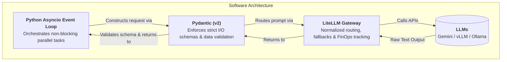

# ⚛️ Venus: Governed Quantum Agents (GQA)

**A governed, natural language interface to quantum-powered discovery.**

[](https://python.org)
[](https://quantumai.google/cirq)
[](https://cloud.google.com/vertex-ai)
[](#)
[](LICENSE)
[]()

> *"Tell the agents what you want to discover. Let them orchestrate the quantum execution safely."*

---

## Table of Contents
- [🎯 TL;DR: The Ultimate Goal](#-tldr-the-ultimate-goal)
- [What Are Governed Quantum Agents?](#what-are-governed-quantum-agents)
- [The Core Thesis](#the-core-thesis)
- [Architecture](#architecture)
  - [Bloat-Free Software Stack](#bloat-free-software-stack)
- [How It Works](#how-it-works)
- [🚀 Quick Start](#-quick-start)
- [Enterprise Readiness & ROI](#enterprise-readiness--roi)
- [Use Cases](#use-cases)
- [Hybrid Infrastructure & LLM Routing](#hybrid-infrastructure--llm-routing)
- [Tech Stack](#tech-stack)
- [Project Status & Roadmap](#project-status--roadmap)
- [Why Now?](#why-now)
- [Relationship to AI Governance Lab](#relationship-to-ai-governance-lab)

---

## 🎯 TL;DR: The Ultimate Goal

The ultimate goal of Venus is to act as a **translation layer** between human intent and complex quantum computers. 

Instead of needing a PhD in quantum linear algebra to write circuit code, a scientist can simply type:
> *"Find a candidate molecule that inhibits this specific enzyme without being toxic."*

Here is exactly what the AI Agents do behind the scenes:
1. **Understand:** The primary LLM parses the plain-English request.
2. **Translate to Math:** The agents figure out which quantum algorithm is needed and write the Python/Cirq code to generate the actual quantum circuit.
3. **Execute:** The circuit is executed (currently on simulators, eventually on real hardware).
4. **Interpret:** Quantum computers return raw probability distributions (1s and 0s). The LLM reads these statistics and translates them back into a human answer.
5. **Govern:** A separate LLM "Governance Judge" watches the entire process to ensure the AI didn't hallucinate, didn't break compliance (like GDPR/HIPAA), and that the science makes sense.

**In short: An AI Agent that safely writes and executes quantum programs on your behalf.**

---

## What Are Governed Quantum Agents?

Quantum computers are not just faster classical computers; they are fundamentally different. They explore vast combinatorial spaces simultaneously—solution landscapes so large that no classical system could traverse them in a human lifetime. However, harnessing that power usually requires deep expertise in quantum circuit design, linear algebra, and algorithmic mapping. The interface to quantum computing has historically been a PhD.

**Venus: Governed Quantum Agents (GQA)** removes that barrier.

rVenus (GQA) is an enterprise-grade agentic AI system that translates a natural language discovery goal into a quantum computation, executes it, and returns human-readable results—all under a strict **AI Governance framework**. You describe what you want to find—a candidate drug molecule, an optimal material structure, a novel synthesis pathway, an engineering solution—and the agents orchestrate everything securely.

```text
"Find me candidate molecules that inhibit the BACE-1 enzyme
 with minimal off-target effects."
                    ↓
        [ Governed Quantum Agent ]
                    ↓
"Here are 7 high-potential candidates ranked by binding affinity
 score, validated for toxicity, with structural rationale for each."
```

---

## The Core Thesis

The human-quantum interface is the primary barrier to enterprise adoption.

Quantum hardware is advancing rapidly, and algorithms for drug discovery, financial optimization, and materials science are proven. What is missing is the translation layer—a system that takes a human goal and turns it into a quantum computation without requiring the user to understand what a qubit or parameterized circuit is.

Furthermore, for this translation layer to be adopted by enterprises, it cannot be a "black box" LLM. It must be **governed, observable, and verifiable**. Venus is built to be that secure translation layer, positioned today for an inflection point that is already visible.

---

## Architecture

The system acts as a **Quantum-Classical Hybrid Orchestrator**, structured around specialized agents:

```mermaid
graph TB
    USER["🧑 Researcher / Scientist / Engineer\nNatural language discovery goal"]
    USER -->|"Plain English"| LANG

    subgraph GQA ["⚛️ Venus: Governed Quantum Agents System"]

        LANG["🗣️ Language Interface Agent\nVertex AI Gemini 2.5 Pro\nIntent parsing & Context"]
        LANG --> PLANNER

        PLANNER["🧠 Planner Agent\nGoal decomposition\nStrategy selection"]

        PLANNER --> BRIDGE

        subgraph BRIDGE ["🔁 Classical–Quantum Bridge"]
            direction LR
            PROB["Problem Encoder"]
            ALG["Algorithm Selector\n(QAOA, VQE, QSVM, Grover)"]
            CIRC["Circuit Generator\n(Cirq)"]
            PROB --> ALG --> CIRC
        end

        BRIDGE --> QEX

        QEX["⚛️ Quantum Execution Layer\nCirq simulator / Cloud Backends"]

        QEX --> INTERP

        INTERP["🔬 Result Interpreter Agent\nTranslates bitstring distributions\nback to domain language"]

        INTERP --> MEM

        MEM["💾 Discovery Memory\nVector Store (ChromaDB/FAISS)"]

        MEM -->|"Refined goal"| PLANNER
        MEM --> OUT

        JUDGE["⚖️ LLM-as-Judge Evaluator\nGovernance & Output Safety"]
        INTERP -.->|"Verification"| JUDGE
        JUDGE -.->|"Approved"| OUT
    end

    OUT["📋 Human-Readable Output\nRanked discoveries & rationale"]

    style GQA fill:#0F0A1A,stroke:#7C3AED,stroke-width:2px
    style BRIDGE fill:#0D1117,stroke:#3B82F6,stroke-width:1.5px
    style JUDGE fill:#4A044E,stroke:#EF4444,stroke-width:1.5px
```



### Bloat-Free Software Stack

To ensure strict enterprise governance and performance, Venus avoids heavy abstraction frameworks (like LangChain or AutoGen) in favor of a lean, deterministic software stack:



**Why this approach?**
- **Deterministic Execution:** By using native `asyncio`, the orchestrator behavior is completely transparent, predictable, and easy to debug.
- **Strict Governance:** Pydantic guarantees that the LLM's raw text output is explicitly coerced into validated JSON schemas. If an LLM hallucinates a missing field or incorrect data type, Pydantic catches and rejects it before it reaches the sensitive quantum execution layer.
- **Provider Agnostic:** LiteLLM provides a single, unified interface. We can hot-swap Vertex AI for local NVIDIA vLLM nodes in milliseconds without changing any agent logic.

---

## How It Works

### Step 1 — Intent Parsing
The language interface (powered by Gemini 2.5 Pro or local models) understands what the user wants to discover. It extracts the domain (chemistry, logistics, etc.), the objective function (minimize, maximize, find candidates), and constraints safely.

### Step 2 — Problem Decomposition
The Planner Agent breaks the goal into subproblems mapped to quantum algorithms:

| Problem Type | Quantum Algorithm | Example |
|---|---|---|
| Combinatorial optimization | **QAOA** | Drug-protein binding optimization |
| Molecular simulation | **VQE** | Ground state energy of candidate molecule |
| Search in unstructured space | **Grover's** | Pattern search in compound libraries |
| Classification | **QSVM** | Toxicity prediction |

### Step 3 — Quantum Circuit Execution
Circuits are built via **Google Cirq** and executed on scalable cloud infrastructure or local servers. The architecture is designed for seamless migration to real quantum backends (IonQ, Google Sycamore) as they mature.

### Step 4 — Result Interpretation & Memory
Raw quantum output (probability distributions over bitstrings) is meaningless without context. The Interpreter Agent translates these back into domain language. Every run is stored in a vector database, allowing the agents to build a map of the discovery space across sessions—refining hypotheses and avoiding dead ends.

### Step 5 — LLM-as-Judge Governance (The Verifier)
Before any result is presented to the user, an independent `Judge Agent` evaluates the output against safety, compliance, and scientific validity guidelines. Hallucinations or insecure interpretations are caught here.

---

## 🚀 Quick Start

### Prerequisites
- Python 3.11+
- Credentials for your preferred LLM provider (e.g., `GEMINI_API_KEY`, `OPENAI_API_KEY`, or local `vLLM`/`Ollama` running)

### Installation
1. Clone the repository:
   ```bash
   git clone https://github.com/AI-Governance-Lab/governed-quantum-agents.git
   cd governed-quantum-agents
   ```

2. Create a virtual environment and install dependencies:
   ```bash
   python -m venv venv
   source venv/bin/activate
   pip install -r requirements.txt
   ```

3. Configure your environment variables:
   ```bash
   cp .env.example .env
   # Edit .env to add your API keys
   ```

### Running a Discovery Goal
```bash
python src/main.py --goal "Find a lightweight alloy composition with tensile strength above 900 MPa"
```

---

## Enterprise Readiness & ROI

Venus is designed for management and executive stakeholders who require strict oversight, budget controls, and measurable ROI from AI investments. 

### 1. AI FinOps & Cost Management
Running hybrid quantum-classical workloads can be expensive. By routing all agentic LLM calls through **LiteLLM**, Venus provides built-in **FinOps capabilities**:
* **Cost-per-Discovery Tracking**: Quantify the exact API and compute cost for every successful discovery.
* **Budget Caps**: Prevent budget overruns by setting hard limits on token usage and cloud API spend per project or department.

### 2. Immutable Audit Trails & Compliance
For heavily regulated industries (Pharma, Finance, Defense), the **LLM-as-Judge** evaluator ensures compliance by generating an **immutable audit log** for every decision. This provides end-to-end traceability of how a molecule was selected or a route was optimized, accelerating FDA, HIPAA, or SOC2 compliance reviews.

### 3. Role-Based Access Control (RBAC)
Venus supports enterprise organizational structures:
* **Scientists / Researchers**: Initiate discovery goals and interact with the results.
* **Governance Officers**: Define the safety guidelines, scientific bounds, and review the audit logs.
* **FinOps Administrators**: Control the hardware routing rules (e.g., forcing local NVIDIA vLLM execution when cloud API budgets are exhausted).

---

## Use Cases

**🛡️ Cybersecurity & Threat Intelligence** *(High Demand)*
> *"Analyze our global network logs to identify zero-day threat patterns and advanced persistent threats (APTs) hiding in the noise."*
> **Execution:** Utilizes Grover's Algorithm to search massive, unstructured log databases exponentially faster than classical SIEM tools. The Governance Judge ensures no sensitive PII/IP is leaked during the analysis.

**💹 Financial Risk & Fraud Detection** *(High Demand)*
> *"Optimize our high-frequency trading portfolio to minimize risk against sudden macroeconomic shocks, while identifying complex, multi-layered fraud rings."*
> **Execution:** Maps risk factors to QAOA for combinatorial optimization. Strict RBAC and audit trails ensure the models comply with SEC/FINRA financial regulations.

**🌍 Climate Tech & Carbon Capture**
> *"Discover novel Metal-Organic Frameworks (MOFs) that maximize CO2 absorption at room temperature."*
> **Execution:** VQE (Variational Quantum Eigensolver) simulates the molecular ground states. The LLM-as-a-Judge verifies the scientific validity against known thermodynamics before presenting the candidate.

**💊 Pharmaceutical Discovery**
> *"Find candidate molecules that could inhibit COX-2 with fewer GI side effects than current NSAIDs."*
> **Execution:** Maps to a VQE circuit, simulates ground state energies, returns ranked compounds validated by the Governance Judge.

**🔬 Materials Science**
> *"Find a lightweight alloy composition with tensile strength above 900 MPa and corrosion resistance suitable for marine environments."*
> **Execution:** Encodes multi-objective optimization as a QAOA problem, searching compositional spaces exponentially faster.

**📦 Logistics & Operations**
> *"Optimize our 47-location delivery network for minimum fuel cost under strict time-window constraints."*
> **Execution:** Vehicle routing mapped to QAOA to find near-optimal solutions, ensuring all constraints are strictly validated.

---

## Hybrid Infrastructure & LLM Routing

Venus is model-agnostic and infrastructure-flexible by design. All LLM calls are routed through **LiteLLM**—a unified proxy that normalizes 100+ providers into a single API. This allows Venus to operate in two distinct modes depending on enterprise requirements:

### Mode 1: Enterprise Cloud (Default)
Venus utilizes **Google Cloud Platform (GCP)** and **Vertex AI** as its primary cognitive engine for unmatched reasoning capabilities.

| Agent Role | Primary Model | Fallback Strategy |
|---|---|---|
| **Language Interface** | `vertex_ai/gemini-2.5-pro` | `groq/llama-3.3-70b` |
| **Planner Agent** | `vertex_ai/gemini-2.5-pro` | `anthropic/claude-3-5-haiku` |
| **Interpreter Agent**| `vertex_ai/gemini-2.5-pro` | `gemini/gemini-1.5-flash` |
| **Governance Judge** | `vertex_ai/gemini-2.5-pro` | `groq/llama-3.3-70b` |

### Mode 2: Private Local (Strict Data Residency)
For organizations with absolute data residency concerns, Venus can run on **local private infrastructure** (e.g., NVIDIA DGX, Dell servers) using local LLMs. In this mode, discovery targets never leave the internal network. We support two local inference engines based on hardware capacity:

#### High-Throughput (NVIDIA A100/H100 + vLLM)
For enterprise-scale discovery and massive concurrent agent operations, Venus routes to **vLLM** for OpenAI-compatible, high-throughput model serving.
| Model via vLLM | Size | Best for |
|---|---|---|
| `vllm/meta-llama/Llama-3.3-70B-Instruct` | 70B | Primary planning & governance |
| `vllm/Qwen/Qwen2.5-Coder-32B-Instruct` | 32B | Complex planning & tool use |

#### Lightweight (CPU/Entry-GPU + Ollama)
For edge environments or lighter workloads.
| Model via Ollama | Size | Best for |
|---|---|---|
| `ollama/llama3.3` | 70B | Primary planning & governance |
| `ollama/llama3.2` | 3B / 1B | Fast intent parsing |
| `ollama/gemma2` | 27B | Reasoning, result interpretation |
| `ollama/deepseek-r1` | 14B | Complex planning |

LiteLLM handles retries, fallbacks, cost tracking, and provider normalization transparently across all modes and backends.

---

## Tech Stack

| Component | Technology |
|---|---|
| **Primary Reasoning Engine** | Google Vertex AI (Gemini 2.5 Pro) / Local vLLM / Ollama |
| **LLM Gateway & Routing** | LiteLLM |
| **Quantum Execution** | Google Cirq |
| **Quantum Algorithms** | QAOA, VQE, Grover's, QSVM |
| **Agent Framework** | Python 3.11, asyncio |
| **Discovery Memory** | FAISS / ChromaDB (Vector Store) |
| **Data Validation** | Pydantic v2 |
| **Infrastructure** | GCP / NVIDIA DGX (A100/H100) / Local Dell Server |

---

## Project Status & Roadmap

| Phase | Milestone | Status |
|---|---|---|
| **v0.1** | Cirq simulation core & Cloud LLM routing (LiteLLM) | ✅ Complete |
| **v0.2** | Vertex AI Gemini 2.5 Pro integration for Agentic loop | 🔄 Active |
| **v0.3** | Governance Evaluator (LLM-as-Judge pipeline) | 📅 Planned |
| **v0.4** | VQE for molecular simulation in chemistry domain | 📅 Planned |
| **v0.5** | Multi-session discovery memory | 📅 Planned |
| **v1.0** | Real quantum hardware backend integration | 📅 Long-term |

---

## Why Now?

Quantum hardware is on an aggressive improvement curve. The systems that will achieve practical quantum advantage in drug discovery and materials science are 3–5 years away. The bottleneck at that point will not be hardware—it will be the interface between quantum capability and human intention. Venus (GQA) is that interface, being built today.

---

## Relationship to AI Governance Lab

Venus (Governed Quantum Agents) is a flagship project under the **AI Governance Lab** umbrella. The internal **LLM-as-Judge evaluation pipeline** used in Venus represents the core philosophy of the Lab: bringing enterprise-grade LLM observability, safety, and strict compliance to the most advanced AI frontiers.

---

*Venus: Governed Quantum Agents · Quantum-Classical Hybrid Discovery Engine · Cirq · Gemini · Built for the next inflection point*
