```mermaid
graph TB
    USER["🧑 Researcher / Engineer\nNatural language discovery goal"]
    USER -->|"Plain English"| LANG

    subgraph GQA ["⚛️ Governed Quantum Agents System"]

        LANG["🗣️ Language Interface Agent\nVertex AI Gemini 2.5 Pro\nIntent parsing & Context"]
        LANG --> PLANNER

        PLANNER["🧠 Planner Agent\nGoal decomposition\nStrategy selection"]

        PLANNER --> BRIDGE

        subgraph BRIDGE ["🔁 Classical–Quantum Bridge"]
            direction LR
            PROB["Problem Encoder"]
            ALG["Algorithm Selector\n(QAOA, VQE, QSVM, Grover)"]
            CIRC["Circuit Generator\n(Cirq)"]
            PROB --> ALG --> CIRC
        end

        BRIDGE --> QEX

        QEX["⚛️ Quantum Execution Layer\nCirq simulator / Cloud Backends"]

        QEX --> INTERP

        INTERP["🔬 Result Interpreter Agent\nTranslates bitstring distributions\nback to domain language"]

        INTERP --> MEM

        MEM["💾 Discovery Memory\nVector Store (ChromaDB/FAISS)"]
        
        MEM -->|"Refined goal"| PLANNER
        MEM --> OUT
        
        JUDGE["⚖️ LLM-as-Judge Evaluator\nGovernance & Output Safety"]
        INTERP -.->|"Verification"| JUDGE
        JUDGE -.->|"Approved"| OUT
    end

    OUT["📋 Human-Readable Output\nRanked discoveries & rationale"]

    style GQA fill:#0F0A1A,stroke:#7C3AED,stroke-width:2px
    style BRIDGE fill:#0D1117,stroke:#3B82F6,stroke-width:1.5px
    style JUDGE fill:#4A044E,stroke:#EF4444,stroke-width:1.5px
```

# ⚛️ Governed Quantum Agents

**A governed, natural language interface to quantum-powered discovery.**

## Overview

**Governed Quantum Agents** is an enterprise-grade agentic AI system designed to bridge the gap between natural language intention and quantum computation. It translates complex discovery goals (e.g., drug discovery, material science optimization) into quantum circuits, executes them, and interprets the results—all under a strict AI Governance framework.

Unlike raw LLM wrappers, this system emphasizes **governance, observability, and safety** for enterprise applications, utilizing top-tier cloud models like **Vertex AI / Gemini 2.5 Pro** as its primary reasoning engine.

## Architecture

The system acts as a Quantum-Classical Hybrid Orchestrator, structured around specialized agents:



## Scope and Capabilities

1. **Pharmaceutical Discovery**: Translates molecular optimization problems to VQE circuits to simulate ground state energies, returning ranked compounds.
2. **Materials Science**: Searches compositional spaces for alloys using multi-objective QAOA optimization.
3. **Logistics & Operations**: Solves NP-hard routing problems with QAOA to find near-optimal solutions under complex constraints.

## Tech Stack

- **Primary Reasoning Model**: Google Vertex AI (`gemini-2.5-pro`)
- **LLM Routing**: `LiteLLM` (multi-provider gateway, fully configured for cloud API usage)
- **Quantum Execution**: Google `Cirq`
- **Quantum Algorithms**: QAOA, VQE, Grover's, QSVM
- **Memory**: ChromaDB / FAISS
- **Governance**: Built-in LLM-as-Judge evaluation pipeline ensuring safety and observability.

## Project Structure

```text
src/
├── agents/             # Core AI Agents (Planner, Interpreter, Judge)
├── bridge/             # Classical-Quantum translation (Encoders, Circuit Generators)
├── interface/          # LiteLLM routing and API gateway configuration
├── memory/             # Vector store integrations
└── quantum/            # Quantum execution and algorithm implementations (QAOA, VQE, etc.)
config/
└── llm_routing.yaml    # LLM configuration (Cloud providers, Vertex AI primary)
```

## Setup

1. Configure your `.env` file with appropriate API keys (e.g., Google Cloud credentials, `GEMINI_API_KEY`).
2. Install dependencies:
   ```bash
   pip install -r requirements.txt
   ```
3. Run the orchestration pipeline:
   ```bash
   python src/main.py
   ```
