# ⚛️ Venus

**A natural language interface to quantum-powered discovery.**

[](https://python.org)
[](https://quantumai.google/cirq)
[](https://deepmind.google/technologies/gemini/)
[](LICENSE)
[]()

> *"Tell Venus what you want to discover. Let quantum do the searching."*

---

## What Is Venus?

Quantum computers are not faster classical computers. They are fundamentally different: they can explore vast combinatorial spaces simultaneously — solution landscapes so large that no classical system could traverse them in a human lifetime.

The problem? Harnessing that power requires deep expertise in quantum circuit design, linear algebra, and algorithm selection. The interface to quantum computing has always been a PhD.

**Venus removes that barrier.**

Venus is an agentic AI system that translates a natural language discovery goal into a quantum computation, executes it, and returns human-readable results. You describe what you want to find — a candidate drug molecule, an optimal material structure, a novel synthesis pathway, an engineering solution — and Venus handles everything in between.

```
"Find me candidate molecules that inhibit the BACE-1 enzyme 
 with minimal off-target effects."
                    ↓
              [ Venus ]
                    ↓
"Here are 7 high-potential candidates ranked by binding affinity 
 score, with structural rationale for each."
```

---

## The Core Thesis

The human-quantum interface is the enterprise adoption barrier.

Quantum hardware is advancing. Quantum algorithms for drug discovery, materials science, financial optimization, and logistics are proven. What is missing is the translation layer — the system that takes a human goal and turns it into a quantum computation without requiring the human to understand what a qubit is.

Venus is that layer. Built over a 3–5 year horizon as quantum hardware matures, positioning today for an inflection point that is already visible.

---

## Architecture

```mermaid
graph TB
    USER["🧑 Researcher / Scientist / Engineer\nNatural language discovery goal"]
    USER -->|"plain English"| LANG

    subgraph VENUS ["⚛️  Venus — Quantum-Classical Hybrid Orchestrator"]

        LANG["🗣️ Language Interface\nGemini · intent parsing · context management"]
        LANG --> PLANNER

        PLANNER["🧠 Planner Agent\nGoal decomposition · strategy selection\nagentic loop with tool use"]

        PLANNER --> BRIDGE

        subgraph BRIDGE ["🔁  Classical–Quantum Bridge"]
            direction LR
            PROB["Problem\nEncoder"]
            ALG["Algorithm\nSelector\nQAOA · VQE · QSVM · Grover"]
            CIRC["Circuit\nGenerator\n(Cirq)"]
            PROB --> ALG --> CIRC
        end

        BRIDGE --> QEX

        QEX["⚛️  Quantum Execution Layer\nCirq simulator · local Dell server\nparameterized circuits · shot sampling"]

        QEX --> INTERP

        INTERP["🔬 Result Interpreter Agent\nLLM-powered · translates bitstring distributions\ninto domain-meaningful candidates"]

        INTERP --> MEM

        MEM["💾 Discovery Memory\nvector store · ranked candidates\nbuild on previous runs"]

        MEM -->|"refined goal"| PLANNER
        MEM --> OUT
    end

    OUT["📋 Human-Readable Output\nRanked discoveries · rationale · next steps"]

    style VENUS fill:#0F0A1A,stroke:#7C3AED,stroke-width:2px
    style BRIDGE fill:#0D1117,stroke:#3B82F6,stroke-width:1.5px
```



---

## How It Works

### Step 1 — Intent Parsing
The Gemini-powered language interface understands what the user wants to discover, in plain terms. It extracts the domain (chemistry, materials, logistics...), the objective function (minimize, maximize, find candidates), and the constraints.

### Step 2 — Problem Decomposition
The Planner Agent breaks the discovery goal into subproblems that can be mapped to quantum algorithms. It selects the appropriate quantum approach:

| Problem Type | Quantum Algorithm | Example |
|---|---|---|
| Combinatorial optimization | QAOA | Drug-protein binding optimization |
| Molecular simulation | VQE | Ground state energy of candidate molecule |
| Search in unstructured space | Grover's | Pattern search in compound libraries |
| Classification | QSVM | Toxicity prediction |

### Step 3 — Quantum Circuit Execution
Circuits are built and executed via **Cirq** on local infrastructure (Dell server). Venus runs quantum simulations at scale — no cloud quantum hardware required at this stage, with architecture designed for seamless migration to real quantum backends (IonQ, Google Sycamore) as they mature.

### Step 4 — Result Interpretation
Raw quantum output (probability distributions over bitstrings) is meaningless without context. The Interpreter Agent translates these distributions back into domain language: candidate molecules ranked by simulated affinity, materials ranked by stability, solutions ranked by optimality.

### Step 5 — Discovery Memory
Every run is stored in a vector database. Venus learns across sessions — refining hypotheses, avoiding dead ends, building a growing map of the discovery space.

---

## Use Cases

**Pharmaceutical Discovery**
> *"Find candidate molecules that could inhibit COX-2 with fewer GI side effects than current NSAIDs."*

Venus maps the molecular optimization problem to a VQE circuit, simulates ground state energies of candidate structures, and returns ranked compounds with structural rationale.

**Materials Science**
> *"Find a lightweight alloy composition with tensile strength above 900 MPa and corrosion resistance suitable for marine environments."*

Venus encodes the multi-objective optimization as a QAOA problem and searches the compositional space exponentially faster than classical grid search.

**Logistics & Operations**
> *"Optimize our 47-location delivery network for minimum fuel cost under time-window constraints."*

Vehicle routing with hard constraints is a canonical NP-hard problem. Venus applies QAOA to find near-optimal solutions in seconds.

---

## Infrastructure

Venus runs on **local private infrastructure** — a Dell server acting as the primary compute node. This is a deliberate architectural choice:

- **No data residency concerns** — discovery targets never leave private infrastructure
- **No quantum cloud costs** — Cirq simulation is computationally intensive but entirely local
- **LLM via API** — only natural language (never raw discovery data) crosses the network boundary to Gemini

```
┌─────────────────────────────────────────────┐
│           Dell Server (local)               │
│                                             │
│  ┌────────────┐   ┌────────────────────┐   │
│  │  Venus     │   │  Cirq Quantum      │   │
│  │  Agent     │──▶│  Simulator         │   │
│  │  Runtime   │   │  (statevector sim) │   │
│  └──────┬─────┘   └────────────────────┘   │
│         │                                   │
└─────────┼─────────────────────────────────-─┘
          │ HTTPS (NL only — no raw data)
          ▼
    ┌─────────────┐
    │ Gemini API  │
    │ (LLM layer) │
    └─────────────┘
```

---

## LLM Providers

Venus is model-agnostic by design. All LLM calls are routed through **LiteLLM** — a unified proxy that normalises 100+ providers into a single API. Switch models per agent, per task, or per cost budget without touching agent logic.

### Supported Models

**Local (zero cost — runs on Dell server via Ollama)**

| Model | Size | Best for |
|---|---|---|
| `ollama/llama3.3` | 70B | Primary planning agent |
| `ollama/llama3.2` | 3B / 1B | Fast intent parsing, low latency |
| `ollama/mistral` | 7B | Instruction following, summarisation |
| `ollama/gemma2` | 27B / 9B | Reasoning, result interpretation |
| `ollama/phi3` | 14B / 3.8B | Lightweight tasks, low VRAM |
| `ollama/deepseek-r1` | 14B | Chain-of-thought, complex planning |

**Free API tier (cloud, no local VRAM cost)**

| Model | Provider | Free Tier |
|---|---|---|
| `groq/llama-3.3-70b-versatile` | Groq | 14,400 req/day — fastest inference available |
| `groq/llama-3.1-8b-instant` | Groq | 14,400 req/day |
| `groq/mixtral-8x7b-32768` | Groq | 14,400 req/day |
| `gemini/gemini-1.5-flash` | Google | 1,500 req/day |
| `gemini/gemini-2.0-flash-exp` | Google | Free during preview |
| `together_ai/meta-llama/Llama-3-8b-chat-hf` | Together.ai | Free credits on signup |
| `mistral/mistral-small-latest` | Mistral | Free tier available |
| `openrouter/meta-llama/llama-3.2-11b-vision-instruct:free` | OpenRouter | Aggregates multiple free models |

**Top-tier paid (cloud — use selectively for highest-complexity tasks)**

| Model | Provider | Best for |
|---|---|---|
| `anthropic/claude-opus-4-6` | Anthropic | Complex scientific reasoning |
| `anthropic/claude-sonnet-4-6` | Anthropic | Planning, best cost/performance ratio |
| `gemini/gemini-1.5-pro` | Google | Long-context, multimodal |
| `openai/gpt-4o` | OpenAI | General fallback |

### Model Routing Strategy

Each agent in Venus has a configurable model profile. Defaults are tuned for zero / near-zero cost:

```yaml
# config/llm_routing.yaml
agents:
  language_interface:
    primary:   "groq/llama-3.3-70b-versatile"   # free, fast
    fallback:  "ollama/llama3.3"                  # local if Groq down
    heavy:     "anthropic/claude-sonnet-4-6"      # for ambiguous complex goals

  planner:
    primary:   "ollama/llama3.3"                  # local, no cost
    fallback:  "groq/llama-3.3-70b-versatile"
    heavy:     "anthropic/claude-opus-4-6"        # for multi-step discovery plans

  interpreter:
    primary:   "ollama/gemma2"                    # good at structured reasoning
    fallback:  "gemini/gemini-1.5-flash"          # free tier
    heavy:     "gemini/gemini-1.5-pro"            # for nuanced scientific output

  judge:                                           # LLM-as-Judge eval pipeline
    primary:   "groq/llama-3.3-70b-versatile"
    fallback:  "ollama/mistral"

routing_rules:
  prefer_local: true          # always try Ollama first if model available
  max_cost_per_call_usd: 0.05 # hard cap — escalate to heavy only if needed
  fallback_on_timeout: true
```

LiteLLM handles retries, fallbacks, cost tracking, and provider normalisation transparently.

---

## Tech Stack

| Component | Technology |
|---|---|
| Quantum execution | Google Cirq |
| Quantum algorithms | QAOA, VQE, Grover, QSVM |
| LLM router | LiteLLM (unified multi-provider gateway) |
| Local LLM inference | Ollama (Dell server) |
| Cloud LLMs | Anthropic, Google Gemini, Groq, Together.ai, Mistral, OpenRouter |
| Agent framework | Python 3.11, asyncio, custom agentic loop |
| Discovery memory | Vector store (FAISS / ChromaDB) |
| Data models | Pydantic v2 |
| Infrastructure | Dell server (Cirq + Ollama local) |
| Serialization | JSON + custom circuit export |

---

## Project Status & Roadmap

| Phase | Milestone | Status |
|---|---|---|
| **v0.1** | Cirq simulation core · basic QAOA implementation | ✅ In progress |
| **v0.2** | Gemini agent integration · natural language → circuit | 🔄 Active |
| **v0.3** | VQE for molecular simulation · chemistry domain | 📅 Planned |
| **v0.4** | Discovery memory · multi-session continuity | 📅 Planned |
| **v0.5** | Multi-domain support · materials, logistics | 📅 Planned |
| **v1.0** | Real quantum hardware backend (IonQ / Sycamore) | 📅 Long-term |

---

## Why Now?

Quantum hardware is on an aggressive improvement curve. The systems that will achieve practical quantum advantage in drug discovery and materials science are 3–5 years away. The bottleneck at that point will not be hardware — it will be the interface between quantum capability and human intention.

Venus is that interface, being built today.

---

## Relationship to AI Governance Lab

Venus includes an internal **LLM-as-Judge evaluation pipeline** for assessing agent output quality. This component is being extracted as a standalone open-source project — [**AI Governance Lab**](https://github.com/) — targeting enterprise LLM observability for the European market.

---

*Venus · Quantum-Classical Hybrid Discovery Engine · Cirq · Gemini · Built for the next inflection point*
